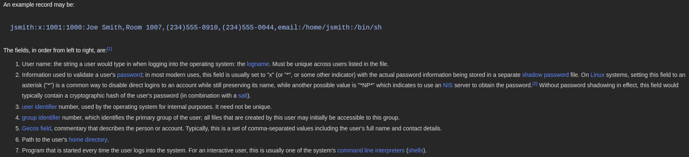
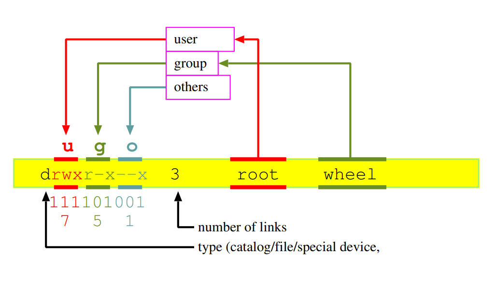
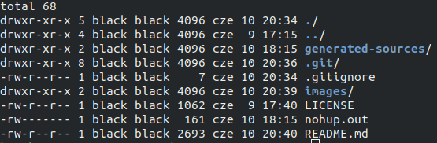

<!-- $theme: gaia -->

# Bezpieczeństwo 2018

---

## Zastrzeżenie

To nie jest przewodnik totalny. Jedynie tłumaczy niektóre slajdy, które wydawaly mi się zawikłane i musiałem googlować, lub pamiętałem, że sprawiały miproblemy kiedyś.

Poprawki do ortografi i merytoryki walimy pull requestami: [gitrepo](github.com/TheMesoria/non-total-guide)
Slajdy: [2015](http://dream.ict.pwr.wroc.pl/ssn/bus-www.pdf)

---

## Użytkownicy w systemie UNIX

Linux jest systemem: 

- wielozadaniowym,
- wielo-użytkownikowym

---

## UID w systemie UNIX

**UID** -> ID użytkownika który **STWORZYŁ** ten proces. Może być zmienione, tylko kiedy  proces ma EUID=0.
**GID** -> ID grupy użytkowników.
**EUID** -> [*effective*] używane do ewaluacji zezwoleń procesu. (Tego używasz do stwierdzenia czy proces coś może czy nie.)
**SUID** -> [*Saved UID*] Daje użytkownikowi prawo do wystartowania aplikacji, nie jako on, ale osoba zapisana.
**RUID** -> [*Real UID*] kim tak naprawdę jesteś (nawet jak jesteś rootem, to odpowie twoim loginem)

[source1](https://stackoverflow.com/questions/205070/whats-the-deal-with-all-the-different-uids-a-process-can-have)
[source2](https://www.linux.com/blog/what-suid-and-how-set-suid-linuxunix)

---

## Ważne miejsca na `/`

```bash
# Ten plik ogranicza dostęp do hashy haseł,
# dla wszystkich, z wyjątkiem najbardziej uprawnionych.
/etc/shadow
# Tekstowa baza danych przechowująca dane logowania
# oraz informacje kto może się zalogować.
/etc/passwd
# Plik tekstowy definiujący przynależność do grup.
/etc/group
```

---

## /etc/passwd



[source](https://en.wikipedia.org/wiki/Passwd#Password_file)

---

## Fundamentalne cechy wszytskich systemów UNIX (copy pasta)

- Rozróżnienie na **administratora** oraz **użytkownika**.
- Podział na pracę w trybie **użytkownika** i **jądra.**
- Event Based System - aplikacje są usypiane i czekają na rozbudzenie eventem.
- Wszystkie urządzenia, mechanizmy komunikacji wewnętrznej i sieciowej dostępne są przez przez pliki i deskryptory plików.

---

## CD:

- System plików kontroluje dostęp do plików i blokuje prawa do zapisu.
- Pamięc wirtualna is system plików stosują te same mechanizmy.
- Prosty i spójny interfejs zapewniany przez system operacyjny (300 funkcji, podczas gdy windows kilkadziesiąt tysięcy)

---

## Tryb Jądra

- W trybie jądra realizowane są wszystkie funkcje systemowe
- Przejście do trybu jądra realizowane jest przez przerwanie programowe

---

## Ważne miejsca na `/` *cd*

```bash
# 'File System Table' w dawnych czasach służył 
# do automatycznego montowania dysków
/etc/fstab
# Aktualnie zamontowane systemy plików
/etc/mntab
# ???
/etc/exports
```

---

## Prawa dostępu



---

## Prawa dostępu 2



---

## Prawa dostępu 3

Aby otrzymać dostęp do plików musi być spełniony przynajmniej jeden warunek:

- **EUID** == 0
- **EUID** procesu jest zgodny z właścicielem pliku i ma on prawo do odczytu.
- **EUID** nie zezwala, ale **GUID** zezwala na dostęp i odczyt.
- **EUID**, ani **GUID** nie zezwalają na dostęp, ale plik jest **otwarty**.

---

## Prawa dostępu 4

```bash
# Zmienia prawa dostępu do objektów na systemie plików.
chmod
# 'Change group' zmienia ustawienia dotyczące
# grupy na systemie plików.
chgrp
# 'Change owner' zmienia włąściciela pliku na
# systemie plików. (ROOT potrzebny!)
chown
# Zmień domyślną wartość stanu pliku po zapisie
# na systemie plików
umask
# Zmienia atrybuty plików w systemie plików.
chattr
# wyświetla atrybuty plików w systemie plików.
lsattr
```

---

## Hasła

Referencje
[Kazik 12 Groszy](https://www.youtube.com/watch?v=mnmcdWiotds)

---

## Sniffer

program komputerowy lub urządzenie, którego zadaniem jest przechwytywanie i ewentualnie analizowanie danych przepływających w sieci.
Wspólną cechą wielu takich analizatorów jest przełączenie karty sieciowej w tryb mieszany (ang. promiscuous), w którym urządzenie odbiera wszystkie ramki z sieci, także te nieadresowane bezpośrednio do niego; sniffery mogą być uruchamiane także na routerze lub na komputerze będącym jedną ze stron komunikacji sieciowej – i w tych przypadkach tryb promiscuous nie jest konieczny.

---

